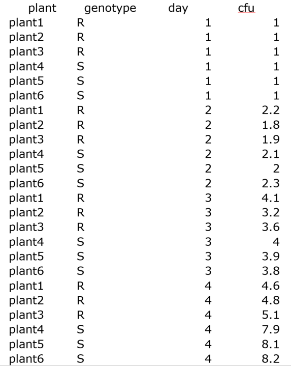
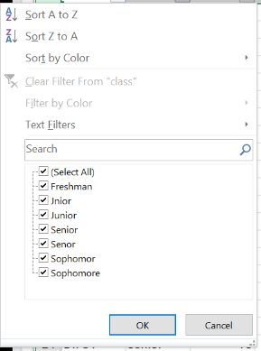

```{r setup, include=FALSE}
knitr::opts_chunk$set(echo = TRUE)
```
# Setup
  
For Purdue University students, **you cannot save fies to the lab computer!**  However, your ITaP home directory should be mapped as the `W:` drive.  Remember to drag your work to your home directory before you log out!
  
  
  
***
**Important!  Make Windows 10 show file name extensions by doing the following**  
  
1. Left-click on an empty area of the Desktop.  
2. Enter `Ctrl + n` to open a File Explorer Window.  
3. Select the `View` tab at the top of the window.  
4. Check the box next to `File name extensions`.  


***
This will make it much easier for you to identify the correct files for the workshop.  **File extensions are an important part of a file name!**  

Locate the Excel01 folder for the workshop on the `lab (R:`) drive on the lab computers, `This PC > lab (R:) > PascuzziPE > Excel01` .  


  
***  


  
***  
  

  
***  

Drag the Excel01 folder to your desktop.  Open the file `Excel01.html` with Chrome or Firefox.  

# Introduction  
  
Excel is a widely used tool for data science and data sharing.  However, Excel has very few rules--you can (dis)organize your data in nearly any way that you want.  In addition, Excel files are generally NOT protected from accidental data entry or deletion, so data corruption is a common problem.  Many researchers and students share their data as Excel files, and it is often very difficult for others to understand or analyze the data because Excel does not encourage good data organization practices.  

An Excel worksheet is inherently a rectangular data format with data arranged in rows and columns.  Generally, each row corresponds to an observational unit such as sample, student or gene, and each column corresponds to a variable such as nitrogen content, class rank or expression level.  

Excel worksheets often become more complex because researchers use them to summarize or analyze their data.  The consequence is that this rectangular data format can break down as researchers include subtables to perform calculations or add rows or columns that contain summary results derived from groups of samples or variables.  An Excel worksheet that includes such information is no longer strictly a data set, but a data analysis document.  

The purpose of this workshop, and the follow up Data Organization with Excel02, is to show you how to use some of the features in Excel that can minimize data organization problems.  In addition, there is a brief overview on rectangular data formats.  ThThese concepts and skills will help you to organize your data and protect it from corruption, making your data to easier to share with other (even if this other is only your future self).  Need more convincing?  Read this perspective on data sharing written by a professional statistician, [How to share data with a statistician](https://github.com/jtleek/datasharing).  

# Learning Objectives  

* Recognize wide, long and tidy formats for rectangular data sets.  
* Learn how to import and export data with Excel to minimize data corruption.  
* Learn how to use Data Filtering in Excel to subset your data sets.  
* Learn how to use Data Validation in Excel to minimize data entry errors and to help you clean your data.  
* Learn how to make an Excel Pivot Table to summarize your data and as tool to aid data cleaning.  

# Rectangular Data 

In rectanglur data formats, samples or other observational units are arranged in rows and the variables that are collected for these samples are arranged in columns.  
  

  
There are many data sets that are not amenable to rectangular format, but it is unlikely that you would try to analyze such data with Excel.  Almost any table can be considered a rectangular data set, but some tables can be a data visualization because they are meant to be read by a person and not a computer, e.g. a menu is a type of table.  
  
Within rectangular data sets, there are two common formats, **wide** and **long**.  A third format named **tidy** is emerging with the increasing use of data science in all fields.  **Tidy** data is essentially a rigorous form of the **long** format that incorporates additional best practices in data management [Wickham, 2014](https://www.jstatsoft.org/article/view/v059i10).  
  
## Wide Data  
  
In **wide** data sets, similar variables are organized into separate columns, but there is information stored in the column name that can be considered a variable.  In the example below, taken from bacterial growth assays in tomato leaves, there are four columns with `cfu` (colony forming units) in the column name, but there is also information in the column name that indicates that the `cfu` was measured on different days.  
  
There is nothing inherently wrong with wide format, and Excel often requires this format for analysis or visualization.  In fact, wide format applies to data matrices which are very common in computational data analysis.  However, wide format is often not amenable to statistical analysis with software other than Excel.  
  

  
## Long Data  
  
In **long** format, similar variables are gathered into a single column that can be aggregated or grouped on additional variables.  The wide format for the bacterial growth assays can be easily (relatively speaking) converted to long format by gathering the values in the `cfu` columns into a single column named `cfu` and introducting a new column named `day` with values derived from the original column names.  
  

  
## Tidy Data  
  
Finally, **tidy** data sets are motivated by the imperative to make your data as transparent as possible.  Each variable should be as simple and unambiguous as possible.  In the example, there is only one ambiguous variable, and that is `day`.  Relatively speaking, the variable is easy to interpret, but there is valuable information missing, i.e. *what exact day of the past several centuries are we talking about?*  For some data sets, this might not be critical, but for an experiment in plant pathology, the environmental can have huge effects on the results.  Thus, it is critical to know the exact date.  
  

  
There is still one problem with this data set in that the `day` format is month-day-year.  It is generally recommended that may you use year-month-day.  However, Excel does not allow year-month-day format in English (Unitd States), a ridiculous decision on the part of Microsoft!  
  
# Opening Text Files.
  
Excel is notorious for corrupting data because of the assumptions that are made about your data type.  The General import method in Excel will often convert specific textual data to dates.  In addition, Excel will strip leading zeroes from numbers used as identifiers.  See this [thread](https://answers.microsoft.com/en-us/msoffice/forum/msoffice_excel-mso_windows8-mso_2013_release/microsoft-excel-corrupts-data-in-csv-files/8337e85c-b1f5-4e99-9ca4-1ab51ae2984e?auth=1) on the Microsoft forum about related issues.  
  
You can avoid these issues if you use the Excel Text Import Wizard, although the process is still imperfect.  
  
1. Make sure that you have the workshop folder on your desktop.  
2. Locate the files **exampleGradeBookCSV.csv** and **exampleGradeBookTAB.txt**.  
3. Double-click on the **exampleGradeBookCSV.csv** file.  Excel should start and open the file.  
4. Look in the first column of the file labelled `student`.  Confirm that this is comprised of three letters and a number.  This is intended to be an anonymous student identifier.  
5. Examine rows 33 and 43.  What happened to the student identifier?  The original data was JUN2 and MAR1.  
  

  
6. Excel has converted the text values to date format because it matched a date pattern that Excel recognizes, even though none of the other values in this column were converted!  
7. We can try to fix this problem.  Highlight cell A33. Go to the Number section of the Menu.  There is a drop-down window which should display Custom.  Select Text from this drop-down.  Did it fix the problem?  No, we now have a number rather than `JUN2`, the original text value.  In fact, if you did not save the original text file, the original data is likely lost!  
  

  
8. We are done with this file.  **Close** Excel and do not save the file.  
9. Locate the file **exampleGradeBookTAB.txt**.  Double-click on it.  It should open with NotePad or WordPad not Excel.  Note that the data is not corrupted in this file!  Close NotePad/WordPad because we will open this file with Excel.   
10. Locate Excel on your lab computer, and open it.  In the bottom left of the window, click on `Open Other Workbooks`.  
  

  

11. Click on `Browse` and navigate to the folder for this workshop.  

  
  
12. At the bottom right of this window is a drop down that displays `All Excel Files`.  Change this to `All Files`.   You should now see all files in the workshop folder.  
  

  
13. Select **exampleGradeBookTAB.txt**.  The Text Import Wizard should open.  
14. In Step 1, confirm that file type is set to `Delimited`, and check the `My data has headers` box. Hit `Next`.  
  

  

15. Note that the first few lines of the file begin with hash signs, `#`.  These lines are metadata (data about data) for this data set.  It is always a good idea to include metadata at the beginning of a file, marking it with a specific character or flag.  
16. In Step 2, confirm that the `Delimiter` is set to `Tab` and the `Text qualifier` is set to `{none}`.  Change these settings to see how it alters the `Data preview`.  Restore the correct settings and enter `Next`.  
  

  
17. In Step 3, change the `Column data format` to Text for the columns labelled `student`, `class` and `letter.grade`.  Click `Finish`.    
  

  
18. Examine rows 36 and 46 (these were rows 33 and 43 in the csv file, but the metadata has shifted their position).  The student identifiers should now be correct because we did not **allow** Excel to guess at the data in this column.  
  

  
# Data Filtering  
  
Data Filtering is a useful Excel feature that is unfamiliar to a surprising number of people.  This workshop includes Filtering primarily to help you clean your data.  A simple Google search of "Excel Filtering" will produce at least dozens of useful guides or videos on additional tips for filtering.  
  
1. Select the `Data` tab at the top of the Excel window.  
2. Highlight row 4 in the data and click on the `Filter` icon.  Small arrows triangles for drop down windows should appear for each column.  
  

  
3. Go to the drop down for the column `class`.  In the bottom of the window, you will see the values for this column.  What is wrong here?  We will fix these data entry errors later.  
  

  
4. Go to the drop down for the column `letter.grade`.  Uncheck `Select all` and select A only.  Excel should display only the four students that received an A in the class.  Note that you can filter on more than one column to obtain very specific subsets of your data.  Try it by selecting only "Sophomores" from the `class` drop down.  
  

  
5. We will use `Data filtering` again in the next workshop.  Reset all columns to `Select all` before proceeding to the next section.  
  
# Data Validation
  
Data Validation is an Excel feature that can help you to clean your data, i.e. make sure that all entries are valid and consistent.  Data Validation is also an excellent tool to help insure that data is entered correctly in the first place.  For example, what if you six undergraduate assistant helping you to collect data on bird observations?  You need to collect date, time, environment, species and behavior for each observation.  Date, time and species would probably be consistent between the students.  But, can you imagine the different ways that each student could enter environment and behavior?  With Data Validation, you can pre-populate the Excel columns with valid values, e.g. for behavior, you could specify flying, perching, eating, singing and bathing.  
  
The exercise will show how to clean the grades data with Data Validation.  
  
1. The "class" column appeared to have some typos.  These would be pretty easy to find and fix manually with this small file, but what if you had thousands of entries?  Fortunately, there is a better way.  
2. In cells L4 through L8, enter the values "valid.class", "Freshman", "Sophomore", "Junior", and "Senior".  This small list will be used by Data Validation.  
  

  
3. Highlight the data in the class column by selecting cell B5.  Hold down `Control` and `Shift` and hit the `Down Arrow`.  All data in column B should now be highlighted.  
  

  
4. In the `Data` tab, find the `Data Validation` icon.  It may or may not be labelled depending on the size of your window.  The menu icon that you want is shown as two rectangles, one with a check and one with a red circle/slash.  Click on the icon and select `Data Validation` from the drop down.  
  

  
5. In the `Allow` window, select `List`.  
6. In the `Source` box, click on the small spreadsheet icon at the right.  Select cells L5 through L8 and click on the spreadsheet icon again.  
  

  
7. Click on `OK` in the `Data Validation` window.  Nothing seems to change in the `class` column, but data validation is now enabled for this column.  
8. Make sure that all data in the `class` column is still highlighted.  Go to `Data Validation` again and select `Circle invalid data`.  
  

  
9. Scroll down, and you should see the invalid entries in the `class` column.  You can fix these by selecting the bad cells and choosing the valid values from the drop down.  
  

  
10. Data validation is an excellent way to check and existing data set, but you can also use it to control data entry as well.  What strategies could you use on the other columns?  Explore the ways that you can use Data Validation with numbers.  
  
# Pivot Tables
  
Pivot Tables and Charts are a powerful tool to help you explore and summarize your Excel data.  Unfortunately, the interface for this tool is not very intuitive, and there are significant changes between Excel versions.  
  
This is a very simple protocol to get you started.  There are numerous tutorials and videos on the web.  In addition, there will be more on Pivot Tables in **Data Organization with Excel 2**.  
  
1. Before proceeding, let's save the file as an actual Excel Workbook.  Go to the `File` tab, select `Save As` from the menu on the left.  Select the folder for the workshop.  
2. The `Save As` window should open.  In the `Save as type` drop-down, select `Excel Workbook`.  Change the file name by removing the TAB and click `Save`.  
3. Select all data in your Excel workbook by selecting cell A4.  Hold down `Ctrl` and `Shift`.  Hit the `right arrow`, then the `down arrow`.  Cells A4 through J104 should now be highlighted.  
  

  
4. Go to the `Insert` tab and select `Pivot Table`.  
  

  
The `Pivot Table` window should open.  Confirm that the data range `$A$4:$J$104` is showing and that the Pivot Table will be placed in a New Worksheet.  Click OK.  
  

  
5. You should now be in a new worksheet.  At the right, there should be a section labelled `Pivot Table Fields`.  Each column from the data set should appear in the top window.  
  

  
6. Drag `class` to the `ROWS` window.  The possible values for class should now appear in your Pivot Table on the left, but there is no more information yet.  
  
  
  
7. Drag `class` to the `VALUES` window.  A column labelled `Count of class` should now appear. 

  
  
  
8. Click on the `Count of class` in the `VALUES` window.  Select `Value Field Settings`.  
  

  
8. In the `Summarize value field by` window, `Count` should be selected.  This is the only valid selection for this data.  
  

  
9. Click on the `Show Value As` tab.  In the drop-down, `No Calculation` should be selected.  Try choosing `% of Grand Total`.  
  

  
10. Let's cross tabulate class with letter.grade.  Drag `letter.grade` to the `COLUMNS` window on the right.  You should now have a column for each letter grade and a row for each class.  
  

  
Use Pivot Tables to summarize additional data from the grade book.  For example, make a Pivot Table that shows `class` in rows and the `Average` of the three tests in columns.  Which class did best on the first test?  Which class did best on the last test?  
  
We will use Pivot Tables again in the next workshop.  

# Exercise
  
In the workshop directory, there is a file named **flights_ex.xlsx**.  This file contains 10000 records from a larger data set for airline flights **originating in New York City** in 2013.  The column names are fairly easy to understand, but you will only need a few for this exercise.  
  
1. There are five data entry errors in the data set, three in one column and two in a second column.  Locate and correct these errors using the techinques from the workshop.  Hint, it will be difficult to use Data Validation because you do not have enough information, but Filtering and Pivot Tables will be helpful.  Identifying the errors will require critical thinking.  
2. Answer the following questions using Pivot Tables, 
    a. Which carrier had the most flights?  
    b. Which carrier had the longest Average flight?  
    c. Which carrier and origin airport had the longest Average delay?  

  
# Useful Information  
  
[Excel Functions](https://support.office.com/en-us/article/Excel-functions-alphabetical-b3944572-255d-4efb-bb96-c6d90033e188). An alphabetical list of available functions for Excel with some information on how to use them.  
[Excel Cheatsheet](http://www.collegedegreesearch.net/excel-cheats/) - Not comprehensive but a nice cheatsheet for common tasks.  
[Disadvantages of Spreadsheets](https://www.denizon.com/spreadsheets/top-10-disadvantages-of-spreadsheets/) - There are likely dozens of documents like this.  Simply put, spreadsheets must used with caution.  They should never be used as the sole format for your datasets!  