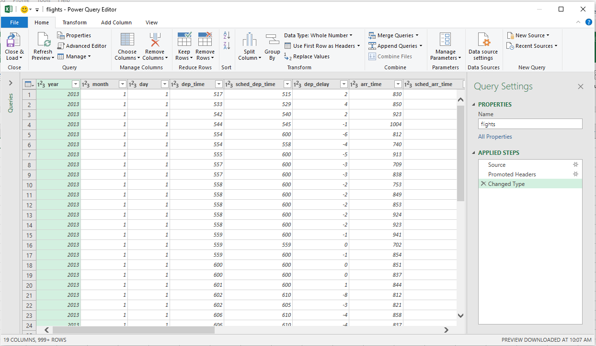
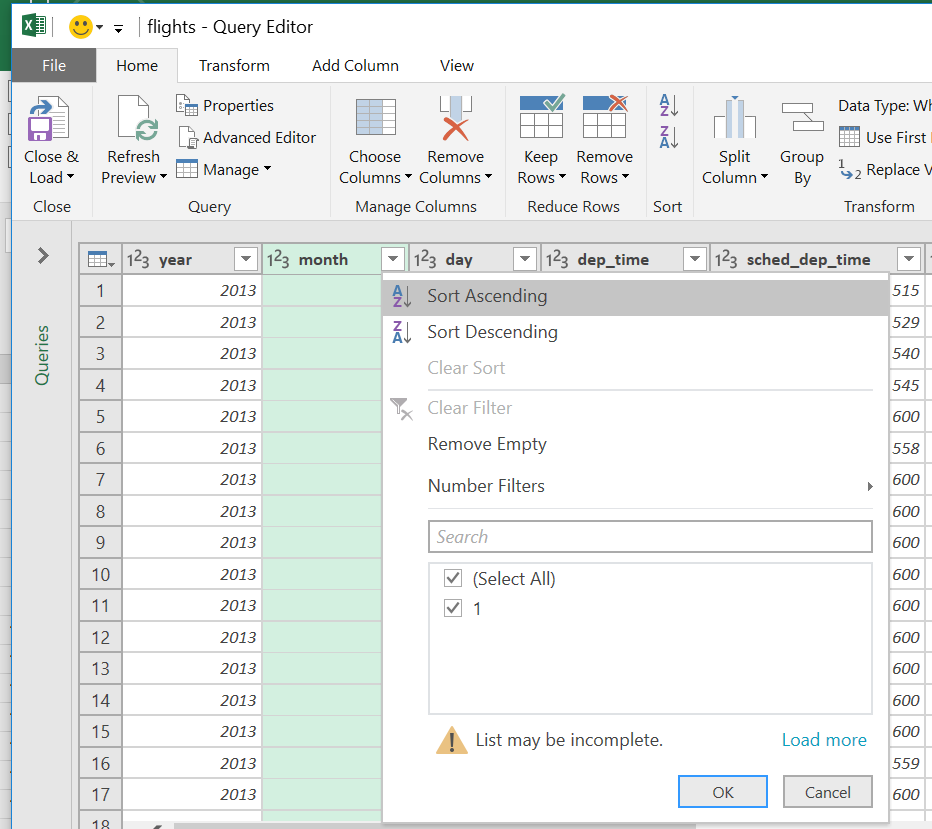
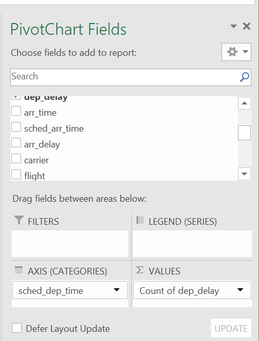
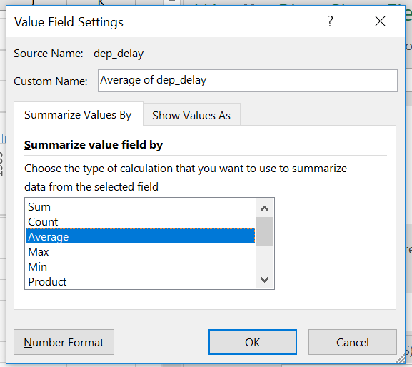
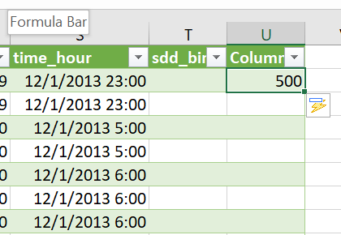
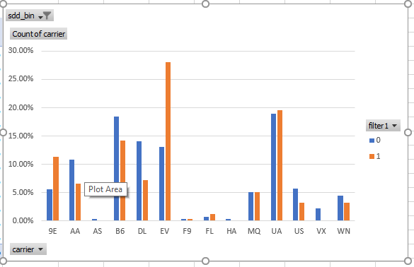

# Setup
  
For Purdue University students, **you cannot save fies to the lab computer!**  However, your ITaP home directory should be mapped as the `W:` drive.  Remember to drag your work to your home directory before you log out!
  
  
  
***
**Important!  Make Windows 10 show file name extensions by doing the following**  
  
1. Left-click on an empty area of the Desktop.  
2. Enter `Ctrl + n` to open a File Explorer Window.  
3. Select the `View` tab at the top of the window.  
4. Check the box next to `File name extensions`.  

  
This will make it much easier for you to identify the correct files for the workshop.  **File extensions are an important part of a file name!**  

Locate the Excel02 folder for the workshop on the `lab (R:`) drive on the lab computers, `This PC > lab (R:) > PascuzziPE > Excel02` .  
  
***
  

***

***

  
Drag the Excel02 folder to your desktop.  
  
# Introduction  

This workshop builds on the workshop, Data Organization with Excel 1.  So, it is assumed that you know use the following:

* Text Import Wizard
* Data Filtering
* Data Validation
* Basic Pivot Tables

Today, we are going to add four new skills to your Excel arsenal:

* Data Queries
* Pivot Charts
* VLOOKUP
* Data Subsetting with Data Filters
  
# Data Queries  

When you work in Excel, your data is typically an integral part of your Excel project, i.e. the data is saved in the Excel spreadsheet.  Some data sets can be too large to work with Excel easily.  In addition, for large data sets, you may only need to analyze a subset of the data.  
 
**Data queries** allow you to link to data external to Excel and to extract only the data that you need.  You then manipulate and analyze a data set minimizing the risk of compromising the original data.  **Remember, datasets are easily corrupted by Excel through accidental data entry!**  A **data query** minimizes that risk.  

In this exercise, we are going to use a data set for airlines flights originating in New York City airports in 2013.  This data set has over 300,000 rows making it a bit challenging for Excel.  For this workship, our goal is to identify carriers with excessive delays from JFK in the month of December, so we do not need to use all of the data in the first place.  

## Protocol
1. Open Excel and select a Blank workbook.  

   

***
  
2. 	Select the `Data` tab then click on `New Query`.

   

***
  
3.	Select `From File` > `From Text` .

   

***
  
4.	Browse to the `flights.txt` file in the workshop folder and import this file.

   

***

5. A preview window for the data file will open.  Click `Edit`, **not Load**!  

5.	The Power Query Editor window will open.  From here, you can select specific rows or columns of the data set, change data types, and a host of other operations.  

   

***
  
7.	This data set contains flight information for major airports around New York City for 2013, and includes more than 300,000 records.  At the top of each column, is the column name.  Excel also indicates its estimate for data type with icons before the column name.  There are numbers for numeric data, letters for text data, etc.  

***  
  
8.	Click on the drop down arrow at the top of the `month` column.  You should see only 1 as possible values here and a warning that the list may be incomplete.  

   

***
  
9. Click `load more`.  You should see the list populate to include months 2 - 12.  Uncheck Select All and check only 12.  Hit `OK`.  

   

***
  
9.	Go to the `origin` column and click on the drop down arrow.  Click on Load More to confirm that all possible values for this variable appear.  Uncheck Select All, check JFK, and click OK.  

   

***
  
10.	 Scan across each column (or variable).  Confirm that the data type makes sense.  All times and distances should be whole numbers.  The `time_hour` column is a date.  

***
  
11.	 Load the selected data by clicking Close & Load at the top left.  The selected data should now load into a new worksheet.  

   

***
  
  
  
***  
  
  
12.	 Information about your query should appear at the left.  You will likely have some errors.  Click on the errors to display this data.  You should see that these errors result from blanks for certain variables. 

   

***
  
We are now ready to analyze the data query with a Pivot Table and Chart.  

# Pivot Tables and Charts

Excel Pivot Tables and Charts allow you to summarize and analyze your data.  They are rather cumbersome to use, but, with some practice, they allow you to perform operations that are not possible within the confines of the spreadsheet itself.  

## Protocol  

1.	Select the Insert tab and click on PivotChart.  

   

***
  
2.	Make sure the flights data appears as the table and insert as a new sheet.  

   

***
  
3.	We want to examine departure delays as a function of departure time to help schedule future flights.  Drag `sched_dep_time` to the AXIS box and `dep_delay` to the VALUES box.  

   

***
  
4.	Change the Value field settings so that `dep_delay` is shown as Average.  

   

***
  

   

***
  
   

***
  
This plot is not very informative, possibly because the `sched_dep_time` is too precise.  Perhaps we should bin these into hourly intervals.  We can use the Excel function **VLOOKUP** to do this data transformation.  

# VLOOKUP

The **VLOOKUP** function is used in Excel to provide a bridge between different types of data.  For example, the function can be used to lookup the price for a given item.  Here, we are going to use it to take the (nearly) continuous variable `sched_dep_time` and transform it to an hourly departure time or range.  

1.  Go back to the worksheet with the flights data.  

2.	Make a new column called `sdd_bin`.  This should be column `T` in your worksheet.    
   

***
  
3.	In the column next to that, i.e. column `U`, you need to enter the numbers 500 - 2400 incremented by 100.  The easy way to do this is with Excel **Fill**.  Enter 500 in cell U2.    

   

***

4.  From the Taskbar, select Fill > Series.

   

***
  
5.  Select `Series in` Columns, and enter a `Step value` of 100 and a `Stop value` of 2400.  Hit OK.  

   

***
  
   

***

4.	In column `V`, copy and paste the numbers from column `U`.  The data in columns `U` and `V` are the table that Excel needs with **VLOOKUP**.  

   

***
  
5.	In the `sdd_bin` column enter this formula, `=VLOOKUP(E2, $U$2:$V$21, 2, TRUE)`

   

***
  
6.	Excel will use this formula to match the `sched_dep_time` in column `E` to the range of values in our table and return the result.  

   

***

You can use **VLOOKUP** to transform many variables based on tables of your design.  For more on **VLOOKUP**, see this [Microsoft Support Page](https://support.office.com/en-us/article/vlookup-function-0bbc8083-26fe-4963-8ab8-93a18ad188a1).

  
# Pivot Chart Continued

1. 	Let's try the Pivot Table again.

2.	Delete the Sheet with the old Pivot Chart. Go back to the worksheet with the flights data.  Click on the small triangle to the left of column `A` and above row `1`.  This should highlight the entire dataset.  

   

***

3.	Select the Insert tab and click on PivotChart.  

4.	Drag `sdd_bin` to the AXIS box and `dep_delay` to the VALUES box.  Make sure the `dep_delay` is shown as Average.  

   

***
5. Your chart should look like this.

   

***

6.	 Right-click on the body of the chart and change the chart type to line.  

   

***

   

***  
  
  
7.	 You should see that the average departure delay increases later in the day.  

   

***  
  
8.	 Is there a relationship between the number of departing flights, departure time and dep delay?  

9.	 Drag `flight` to the VALUES window and display as Count.  Do not remove `dep_delay`!  

10.	 In the plot, right click on the Count of flight data series, select Format Data Series.  

   

***  
  
11.	 At right, Plot Series On Secondary Axis.

   

***  
  
12. You chart should look like this,

   

***  
  
The morning depature rush correlates with a slight average delay time while the evening rush appears to have a stronger correlation.  

# Data Filtering NOT Conditional Formatting

Data filtering for the flights data was turned on when it was imported.  For other data sets, you can turn on data filtering from the Data tab.  Highlight the top row of your data that contains the column names and click the Filter icon at top.  

We want to find flights with excessive departure delays before 10:00 AM.  

1.	Name column `W` `filter1`.  Enter all zeroes, `0`, in this column.  Do not use `Flash Fill` because it can complicate later steps.  You can use `Ctrl + Shift + Down Arrow` to highlight all cells in this row.  Then use `Ctrl + C` to copy the zeroes.  

  

***  
  
2.	Go to `dep_delay` and click the drop down arrow.  

  

***  
  
3.	Select Number Filters > Greater Than Or Equal To, enter 60 and click OK.  

  

***  
 
6.	Go to `sdd_bin` and click the drop down arrow.  Uncheck Select All and select only 500, 600, 700, 800, and 900 and click OK.  

  

***  
 
8.	Go to the `filter1` column and copy and paste all 1 (ones) into these cells as you did with the zeroes in step 1.  

  

***

9.	Go the the dep_delay and sdd_bin columns and Clear Filters.  

10.	 Highlight all cells in the flights data set using the triangle in the upper left corner of the worksheet.  

11.	 Click on Insert > Pivot Table.  

13.	 Drag `carrier` to the AXIS window.  

14.	 Drag `carrier` to the VALUES window.  

15.	 Drag `filter1` to the LEGEND window.  

16.	 Drag `sdd_bin` to FILTERS.  

  

17.  Use the `sdd_bin` FILTER to select flights from 500 - 900.  This is done in the worksheet area.  

  

18.	 Confirm that you have a Clustered Column Chart.  Click on the plot area and choose a clustered column chart if necessary.  

  

19.	 Go to VALUES, Click the drop down and choose Value Field Settings.   Show value as % of Column Total.  

  

20.	 Do any carriers seem to have excessive late flights compared to the flights that depart on time?  

  

This analysis was done only for the month of December at JFK.  Try this analysis with another departure airport or a different month.  Do you think that you could include multiple airports in the chart?  

# Useful Links
[Excel Functions](https://support.office.com/en-us/article/Excel-functions-alphabetical-b3944572-255d-4efb-bb96-c6d90033e188). An alphabetical list of available functions for Excel with some information on how to use them.  

[Excel Cheatsheet](http://www.collegedegreesearch.net/excel-cheats/) - Not comprehensive but a nice cheatsheet for common tasks.  

[Excel Pivot Tables](https://support.office.com/en-us/article/create-a-pivottable-to-analyze-worksheet-data-a9a84538-bfe9-40a9-a8e9-f99134456576) - A modest tutorial on Pivot Tables and Charts.  

[Disadvantages of Spreadsheets](https://www.denizon.com/spreadsheets/top-10-disadvantages-of-spreadsheets/) - There are likely dozens of documents like this.  Simply put, spreadsheets need to be used with caution.  They should never be the sole format for your datasets!  
